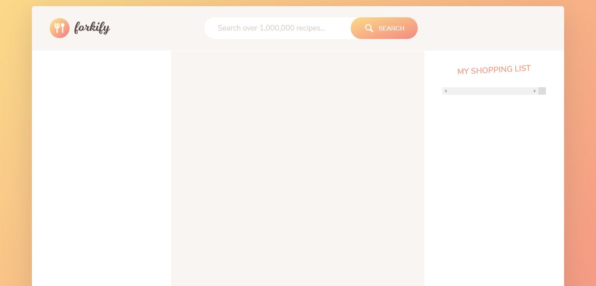
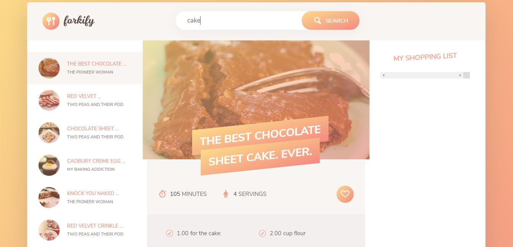

# Forkify_JS
'Forkify' is a very simple recipe searching web application, where you can search over one million recipes where the results will be displayed using real world API. It is being developed using asynchronus Vanilla JavaScript, and Ajax, and API's with the help of advanced DOM manipulation techniques and modern HTML-CSS. Also, third-party packages like Node, npm, Babel, and Webpack are also used. We can search, create our own shopping list, delete recipe from our list and also do many things using this application.

Technology Used:
  1. Asynchronous JavaScript
  2. Babel
  3. Node JS (npm)
  4. Webpack
  5. HTML
  6. CSS

Prefered Tool: Microsoft Visual Studio Code

Application Screenshot:

